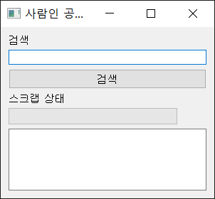
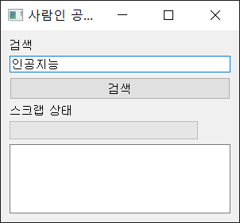
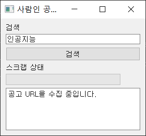
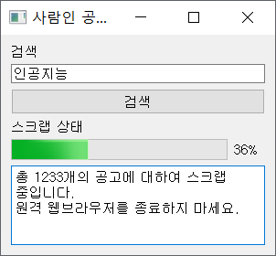
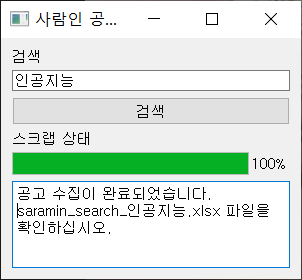

# saramin_crawl
사람인에서 공고 내용을 수집하는 크로울러입니다.

## 실행 파일
pyinstaller로 실행파일을 만들었습니다.  
README.txt를 잘 읽고 chromedriver.exe 파일을 사용자의 PC 환경에 맞게 바꿔주면 파이썬 없이도 실행이 가능합니다.  
윈도우가 아닐 경우에는 '사람인 공고 수집기.bat' 대신에 main 폴더 내에 있는 main.exe를 직접 실행해야 사용할 수 있습니다.  
<a href='https://drive.google.com/file/d/1hyM-8-eBVi0LvcIA2m_ERWza_HKVm2iY/view?usp=sharing'>실행 파일 다운로드</a>

## requires
> - PyQt5 
> - bs4
> - selenium
> - pandas

## UI
PyQt5를 이용하여 GUI로 개발하였습니다. 기능은 검색어 입력과 상태 표시 입니다.

### 기본 화면

### 검색어 입력
키워드를 입력하고 검색 버튼을 클릭하면 관련 공고를 크로울링 및 스크랩을 시작합니다.  

### 상태 표시 1: crawling status
검색어를 포함하여 requests를 보내고 검색 결과의 공고 URL을 수집합니다. 몇 초 정도 걸릴 수 있습니다.  

### 상태 표시 2: scrapping status
- 크로울링한 공고의 URL로부터 정보를 스크랩합니다. selenium을 이용하였기 때문에 원격 조종 크롬 브라우저가 새창으로 열립니다.  
- 원격 크롬 브라우저가 자동으로 공고의 URL로 이동하면서 response를 렌더링합니다.  
- 진행 상황은 progressbar에 표시됩니다.

### 상태 표시 3: finish
스크랩 중에는 csv 파일로 저장하다가, 스크랩이 모두 끝나면 엑셀 파일로 변환합니다.  
파일 명은 `saramin_search_{검색어}.xlsx`로 저장됩니다.  

### 결과물
수집 결과는 다음과 같이 보여집니다.  
컬럼명은 기업명, 근무자수, 기업주소, 공고근무지, 모집인원, 지원자수, 스크랩주소, 스크랩시간 입니다.  
공고로부터 알 수 없는 내용은 -1로 채워집니다.

  
  
※ 크로울러로 수집한 데이터 사용에 대한 법적 책임은 사용자에게 있습니다.  
학업 실습용으로 개발하였으며 취업준비생에게 도움이 되길 바랍니다.
